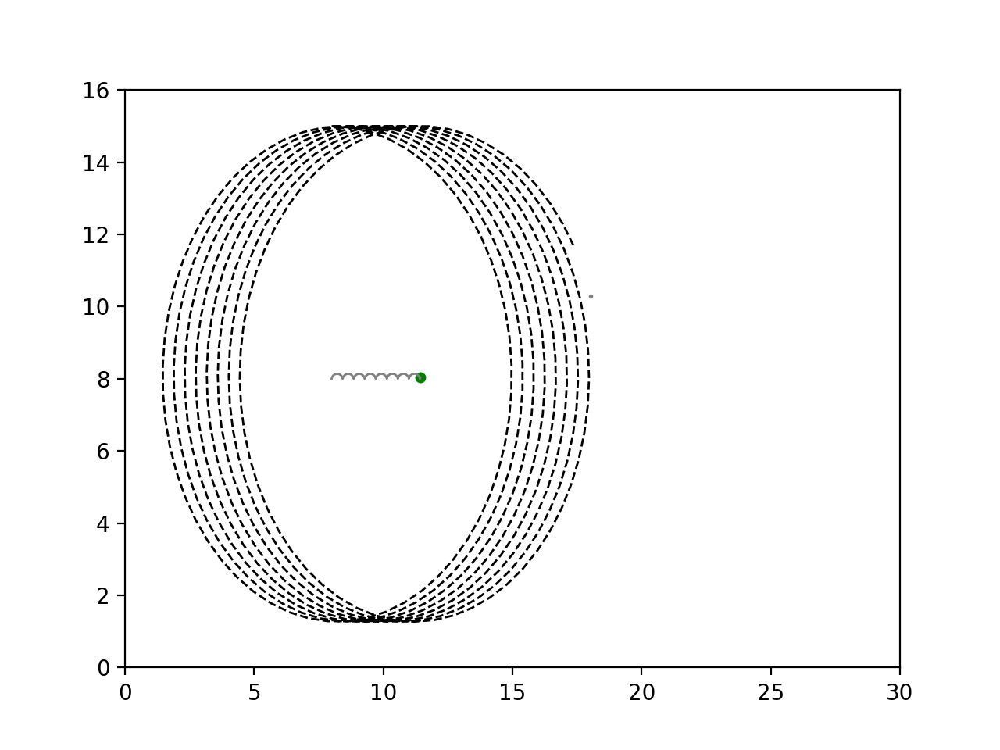
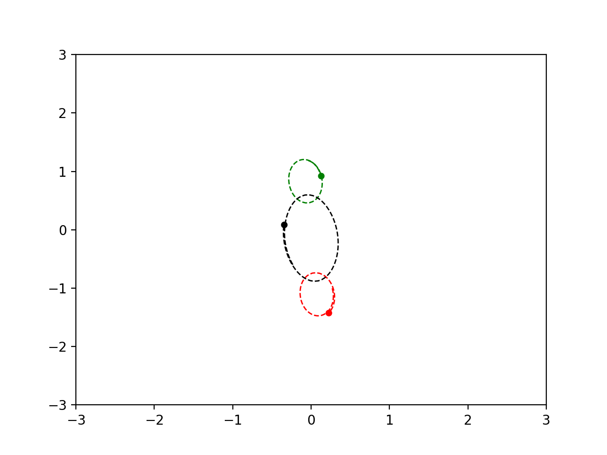

# MassSim

## Introduction
This project began when a friend introduced me to the Chinese novel, The Three-Body Problem. Google instead returned the wikipedia page for the Three Body Problem in classical mechanics. In this repository, my latest attempt to simulate n-bodies in N dimensions as an introduction to numerical analysis methods and simulation. Note that this project makes no attempt to find solutions/initial parameters to the Three-Body Problem.

## Notes
I am fully aware that Python has modules (i.e. scipy.integrate.odeint) that will far more effectively approximate ODEs than my own implementation. Implementing rk4 was a learning experience and a first stab at numerical analysis (broad familiarity with Euler method aside).

A class system was built for the sake of practicing Python OOP. I have not tested but it is likely that storing a single numpy array of initial parameters would improve the rk4 runtime (but if I was concerned with runtime, I wouldn't have implemented myself!)

## Methodology
My initial method calculated gravitational acceleration at each time step, incremented velocities by the given amount, and incremented position in each direction by the velocity vector. This proved a poor approximation, stepping by a full time unit each iteration. I considered using scipy.integrate.odeint but found it to be inflexible. I came across rk4 when reading through a project simulating fluid dynamics around a cylinder. It only took a bit of research to adapt it to mass systems (conversion of 2nd-order ODE to 1st-order ODEs). 

The secondary benefit of my own implementation was flexibility (despite no further use for this project). I wanted an implementation that would be entirely flexible in the number of bodies (n) and the dimension. This may still have been posible with the scipy module but I did not immediately think of one, so began scratching together the current python implementation. The implementation works as follows:

1. Pick a body
2. (rk4) Increment each factor by the effect of its neighbours and prior dependent factors
3. Once all factors are completed, save the next step values for velocity and position in an array
4. Repeat until next step values for all bodies are completed
5. Update body attributes (position and velocity vectors)
6. Repeat

## Images

Below are snapshots from two simulations. The first is an approximation of the orbit of the moon around the Earth (mass = 10 vs mass = 1). Similar radius not used for scale. The second is a solution to the Three-Body Problem with initial parameters from Matt Sheen's repo (example 1) linked in sources

### Sources
[Initial reference on RK4](https://en.wikipedia.org/wiki/Runge%E2%80%93Kutta_methods)

[Initial reference on Three-body problem](https://en.wikipedia.org/wiki/Three-body_problem)

[Research on first-order setup of gravitational systems](http://spiff.rit.edu/richmond/nbody/OrbitRungeKutta4.pdf) Note that this document has an error on the k-coefficients of the position ODE, must be addition e.g. k2r = k1r + k1v * (h/2), not k2r = k1r * k1v * (h/2)

[Matplotlib documentation and examples for animation, particlarly double-pendulum example](https://matplotlib.org/3.1.1/gallery/animation/double_pendulum_sgskip.html)

[Example 3-body solution initial parameters from Matt Sheen's repo](https://github.com/mws262/MAE5730_examples/) Matt has a many exampels of cool stable solutions to the problem implemented in Matlab. I have used (I believe) the initial parameters from his first example
